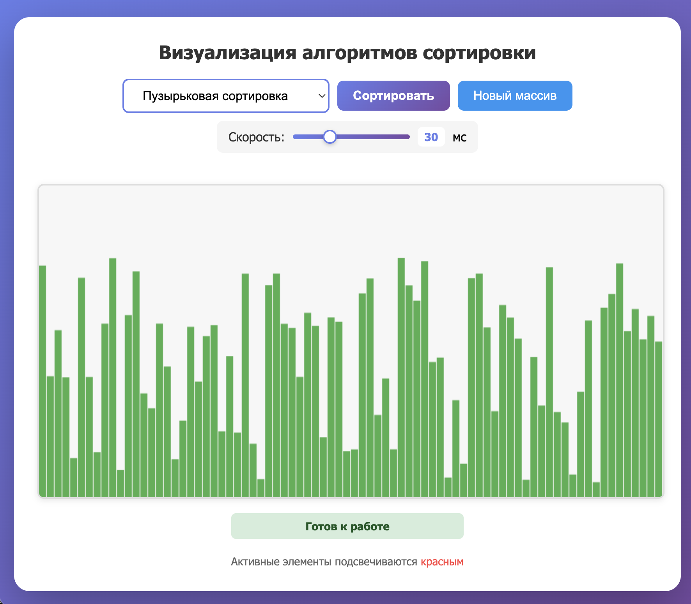

#  Визуализация алгоритмов сортировки - (Sorting Visualizer) 



[](https://developer.mozilla.org/en-US/docs/Web/JavaScript)
[](https://developer.mozilla.org/en-US/docs/Web/HTML)
[](https://developer.mozilla.org/en-US/docs/Web/CSS)
[](LICENSE)

Sorting Visualizer — это интерактивный веб-инструмент для наглядной демонстрации работы классических алгоритмов сортировки. Проект позволяет наблюдать за процессом сортировки в реальном времени, изменять скорость анимации и управлять выполнением.

## Особенности реализации

- Пузырьковая сортировка: Последовательно сравнивает соседние элементы и меняет их местами;
- Быстрая сортировка: Разделяет массив на части относительно опорного элемента;
- Сортировка слиянием: Рекурсивно делит массив на части и сливает их в отсортированном порядке.

## Установка и запуск

Для работы приложения требуется современный веб-браузер (Chrome, Firefox, Safari, Edge).

1. Клонируйте репозиторий

```
git clone https://github.com/your-username/sorting-visualizer.git

cd sorting-visualizer
```

2. Откройте файл index.html в браузере:
   
```
# macOS
open index.html

# Linux
xdg-open index.html

# Windows
start index.html
```

## Быстрый старт

Минимальный пример использования. После загрузки страницы вы сразу можете выбрать алгоритм и наблюдать за сортировкой случайного массива.

```html
<!-- index.html -->
<canvas id="canvas" width="800" height="400"></canvas>

<select id="algorithm">
  <option value="bubble">Пузырьковая сортировка</option>
  <option value="quick">Быстрая сортировка</option>
  <option value="merge">Сортировка слиянием</option>
</select>

<button id="actionBtn">▶ Сортировать</button>

<script type="module">
  import { generateArray, startSort } from './js/main.js';
  generateArray();
  document.getElementById('actionBtn').onclick = startSort;
</script>
```

Просто откройте страницу, нажмите кнопку — и вы увидите, как массив упорядочивается шаг за шагом.

## Возможности

- Визуализация в реальном времени — наблюдение за процессом сортировки с анимацией;
- Три алгоритма сортировки — пузырьковая, быстрая и сортировка слиянием;
- Регулировка скорости — настройка задержки между итерациями от 1 до 100 мс;
- Генерация случайных массивов — создание новых наборов данных для сортировки;
- Управление процессом — единая кнопка для запуска и остановки сортировки;
- Визуальная обратная связь — подсветка активных элементов и статус сортировки;
- Модульная архитектура — разделение кода на логические модули;
- Асинхронная обработка — корректная работа с отменой операций.

## Философия

Этот проект создан, чтобы сделать изучение алгоритмов сортировки наглядным и интерактивным. Вместо абстрактных блок-схем вы видите, как каждый шаг алгоритма изменяет расположение элементов.

Вдохновением послужили классические визуализации из курсов Computer Science, но с фокусом на простоту использования и чистоту кода. Если вы когда-либо пробовали объяснить разницу между O(n²) и O(n log n), этот инструмент поможет показать её буквально на глаз.

Мы придерживаемся подхода минимализма и ясности — никаких лишних зависимостей, только нативный JavaScript, HTML и CSS. Проект одинаково полезен как для новичков в программировании, так и для преподавателей, ищущих наглядные материалы.

## Внутренняя структура

|  Модуль        |  Описание  
|----------------|---------------------------------------------
| main.js        |  Точка входа: инициализация, обработка событий, управление состоянием (запуск/остановка).
| main.js        |  Отрисовка на Canvas, генерация случайных массивов, асинхронная задержка с возможностью остановки.
| bubbleSort.js  |  Реализация пузырьковой сортировки (Bubble Sort).
| quickSort.js   |  Реализация быстрой сортировки (Quick Sort).
| mergeSort.js   |  Реализация сортировки слиянием (Merge Sort).

## Примеры

### Запуск сортировки и остановка

```js
// js/main.js (фрагмент)
async function startSort() {
  startSortingProcess();          // Устанавливаем флаг активной сортировки
  updateButtonsState(true);       // Меняем интерфейс: кнопка становится "Стоп"
  
  try {
    if (algorithm === 'bubble') await bubbleSort();
    if (algorithm === 'quick')  await quickSort();
    if (algorithm === 'merge')  await mergeSort();
    updateStatus('completed', 'Сортировка успешно завершена!');
  } catch (error) {
    if (error.message === 'Сортировка остановлена') {
      updateStatus('stopped', 'Сортировка остановлена пользователем');
    }
  } finally {
    stopSortingProcess();         // Сбрасываем флаги
    updateButtonsState(false);    // Кнопка снова "Сортировать"
  }
}
```

### Асинхронная задержка с возможностью остановки

```js
// js/utils/helpers.js
export async function sleep(ms) {
  return new Promise((resolve, reject) => {
    const timeoutId = setTimeout(resolve, ms);
    const intervalId = setInterval(() => {
      if (stopSorting) {
        clearTimeout(timeoutId);
        clearInterval(intervalId);
        reject(new Error('Сортировка остановлена'));
      }
    }, 10);
  });
}
```

### Генерация и отрисовка массива

```js
// js/utils/helpers.js
export function generateArray() {
  array = [];
  for (let i = 0; i < 80; i++) {
    array.push(Math.random() * 300 + 10);
  }
  drawArray();
}

export function drawArray(active = []) {
  ctx.clearRect(0, 0, canvas.width, canvas.height);
  for (let i = 0; i < array.length; i++) {
    ctx.fillStyle = active.includes(i) ? "#ff4444" : "#4caf50";
    ctx.fillRect(i * 10, canvas.height - array[i], 9, array[i]);
  }
}
```

## Управление

|         Элемент        |        Действие  
|------------------------|---------------------------------------------
| Выпадающий список      |  Выбор алгоритма (Bubble / Quick / Merge)
| Кнопка действия        |  Отрисовка на Canvas, генерация случайных массивов, асинхронная задержка с возможностью остановки.
| Кнопка «Новый массив»  |  Реализация пузырьковой сортировки (Bubble Sort).
| Ползунок скорости      |  Реализация быстрой сортировки (Quick Sort).
| Индикатор статуса      |  Реализация сортировки слиянием (Merge Sort).

## Ограничения

 - Размер массива фиксирован (80 элементов) для оптимальной визуализации на Canvas 800×400;
 - Алгоритмы реализованы в классическом синхронном стиле с асинхронными задержками. Это позволяет наблюдать процесс, но не отражает реальную производительность алгоритмов (которая в данном случае не измеряется);
 - Остановка сортировки происходит с задержкой до 10 мс — это не мгновенно, но незаметно для пользователя и достаточно для корректной работы.

## Внешние зависимости

Проект не использует внешних библиотек или фреймворков. Всё построено на нативном JavaScript, HTML5 Canvas и CSS3. Это обеспечивает:

- Лёгкость развёртывания (просто скопируйте файлы);
- Прозрачность кода для обучения;
- Максимальную производительность анимации.

## Лицензия

Copyright (c) 2026. Проект распространяется под лицензией MIT. Подробнее см. в файле LICENSE (на данный момент отсутствует).

### Дополнительные ресурсы

Демо — [ссылка на GitHub Pages](https://ria-nix.github.io/sav/)

Документация — этот файл README

